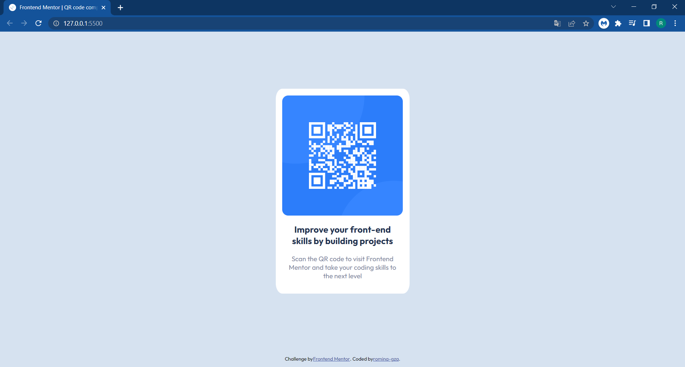

# Frontend Mentor - QR code component solution

This is a solution to the [QR code component challenge on Frontend Mentor](https://www.frontendmentor.io/challenges/qr-code-component-iux_sIO_H). Frontend Mentor challenges help you improve your coding skills by building realistic projects. 

## Table of contents

- [Overview](#overview)
  - [Screenshot](#screenshot)
  - [Links](#links)
- [My process](#my-process)
  - [Built with](#built-with)
  - [What I learned](#what-i-learned)
  - [Continued development](#continued-development)
  - [Useful resources](#useful-resources)
- [Author](#author)
- [Acknowledgments](#acknowledgments)

## Overview

### My Screenshot



### Links

- Solution URL: [My solution URL here in GitHub](https://github.com/romina-gza/qr-code-challenge)
- Live Site URL: [My live site URL with GitHub Pages](https://your-live-site-url.com)

## My process

### Built with

- Semantic HTML5 markup
- CSS custom properties
- Flexbox
- Mobile-first workflow
- Sass

### What I learned

Well, this year i can saw the semantic tags, i don`t known them but now i can say that is for order the boxs of html like div, forms, etc. These are techniques i want to perfect.

```html
<!-- HTML -->
<section>Some HTML code I'm proud of are the "semantic tags", this is that i learned to use on this last two months</section>
```
At first of this year i started to work with code, i like it, and CSS was the first best thing of this process. But "Movil First" is very 
desafiant to me yet.

```css
/* CSS */
.proud-of-this-css {
  color: papayawhip;
}
/* Movil First */
@media (min-width: 320px) and (max-width: 576px) {
  body {
    background-color: hotpink;
  }
}
```

SCSS was difficult at first, today i use it and i love it, but how i am starting to work with it when i begin another project i forget some tags.

```scss
//SCSS
body {
  section {
    background-color: aliceblue;
  }
}
```

### Continued development

I want to perfect all that i learned even now and this is HTML, CSS and i want deeped SCSS, Movil first and Java Script. I can't connect JS with HTML yet but is something that i have plan to do.

### Useful resources
how i am starting i was searching on internet:

- [Sass, El Manual Oficial](https://uniwebsidad.com/libros/sass/capitulo-1) - This helped to use SCSS, i check it when i forget how to use it.
- [Movil-first vs Desktop-first](https://joegalley.com/articles/mobile-first-vs-desktop-first-media-queries) - And this link is about "mobile-first", with this information i understood how to applicate it in my projects.


## Author

- GitHub-User - [@romina-gza](https://github.com/romina-gza)
- Frontend Mentor - [@romina-gza](https://www.frontendmentor.io/profile/romina-gza)


